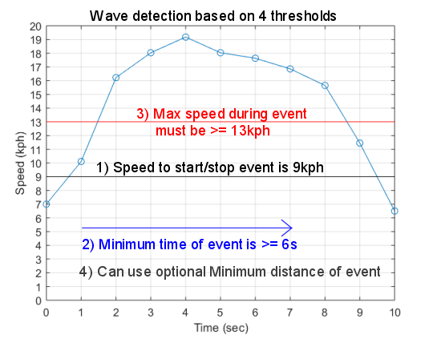
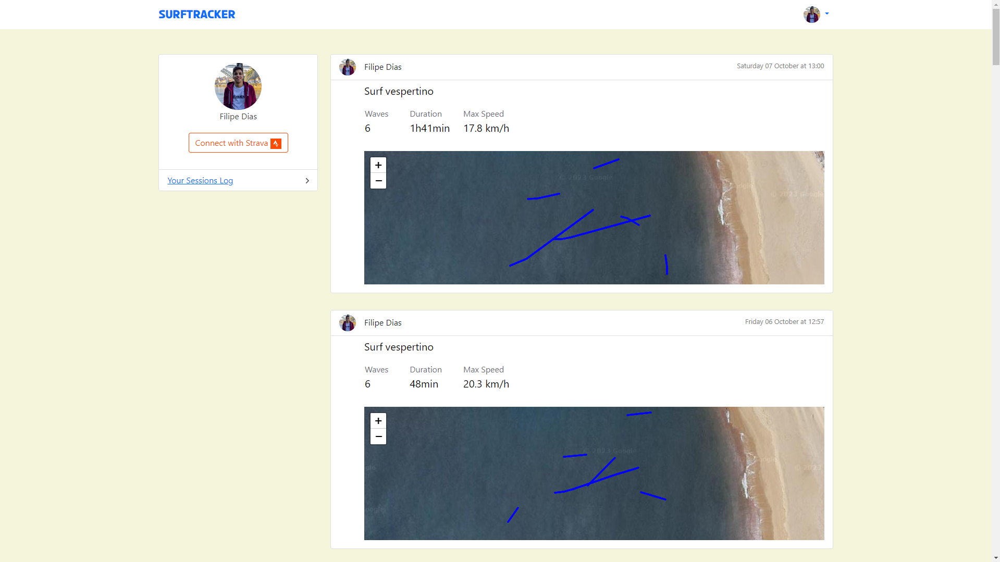

## SurfTracker

SurfTracker is an open-source project dedicated to creating an app that revolutionizes the way surfers record, analyze, and share their surfing experiences. 

The challenge here is how to detect waves, inspired on Garmin solution, I implemented this:

## Project Status

This project is currently in development. Users can load strava data to see their surfing activities.
Functionality to automaticly update strava data is in progress.

## Key Features:

- Session Tracking: Easily log and store your surf sessions, capturing important data such as location, date, time, wave conditions, and session duration.

- Performance Insights: SurfTracker offers a comprehensive suite of analytics tools to help surfers assess their performance, including metrics like wave count, distance covered, top speed, and ride duration.

## Project Screen Shots

## Installation and Setup Instructions

Clone down this repository. You will need `python` and `django` installed globally on your machine.  

Installation:

`pip install -r requirements.txt`

Run delete_server_and_restart.bat

To Start Server:

`python manage.py runserver`  

To Visit App:

`localhost:8000`  

